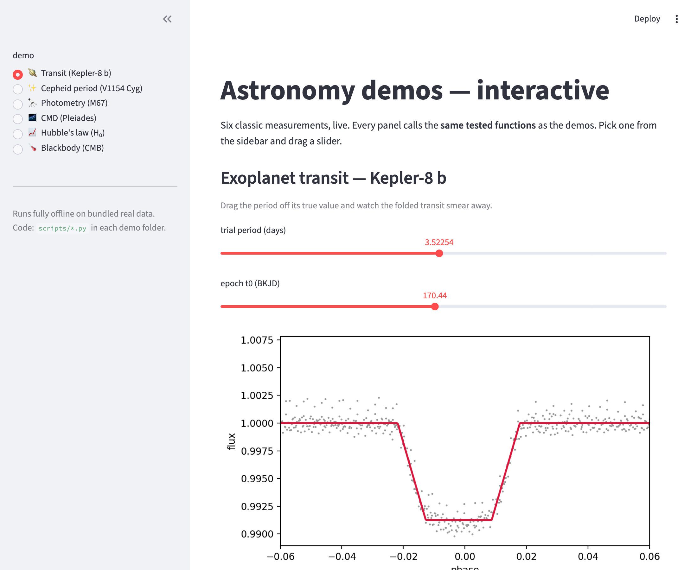
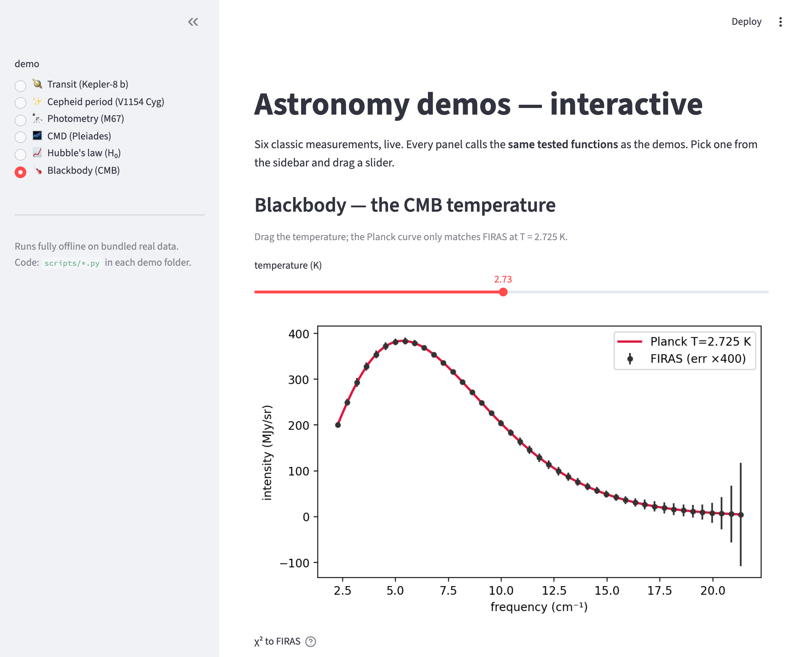

# Astronomy data problems, built with an agentic coding tool

A teaching collection. Each subdirectory is a **classic undergraduate astronomy
data problem**, solved twice over:

- **`PLAN.md`** — the design doc written *before* any code: what we're building,
  the method, and the one external library we validate against. This is what you
  produce in Claude Code's **plan mode** and approve before the agent starts.
- **`project/`** — the finished reference solution (the "answer key"): an
  exploratory notebook, refactored Python modules, a real + synthetic dataset, a
  test suite, figures, and prose notes.
- **`walkthrough/`** — the **agentic-coding side**: the actual prompts you would
  give Claude Code (or any agentic tool) to build `project/` from an empty folder.

The flow is always **plan → prompt → project**: read `PLAN.md`, then drive the
agent through `walkthrough/PROMPTS.md`, producing something like `project/`.

The science is classic on purpose. The point is not the astronomy — it's learning
to **drive an AI coding agent like a professional scientist**: with version
control, tests, notes, and a skeptical eye on every plot.

---

## The five habits every demo teaches

These are the things that separate "I asked the AI and pasted what it gave me"
from real computational science:

| # | Habit | How the demo forces it |
|---|-------|------------------------|
| 1 | **Take notes** | Every demo writes `notes/NOTES_*.md` (what you tried) and `notes/HANDOFF_*.md` (the headline result, files, what's left). Prose survives across sessions; chat history does not. |
| 2 | **Use version control** | The git history of `project/` is built to mirror the prompt steps. `git log --oneline` reads like a lab notebook; each step is a checkpoint **tag** you can rewind to. |
| 3 | **Inspect your plots** | You don't trust a number until you've *looked* at the fit and its residuals. Demos save figures to `results/` and the prompts explicitly ask the agent to judge them and iterate. |
| 4 | **Weave notebook ↔ script** | Explore interactively in `notebook.ipynb`, then refactor the working logic into `scripts/X.py` as an importable function **with a command-line interface**, then import it back. Notebooks are for thinking; scripts are for trusting. |
| 5 | **Test against validated code** | The defining habit. Every headline number is checked two ways: (a) it recovers a **known injected answer** in synthetic data, and (b) it agrees with a **canonical external library** (`batman`, `astropy`, `photutils`, …) within tolerance. |

---

## The demos

| Dir | Problem | Data modality | External answer key |
|-----|---------|---------------|---------------------|
| `01_transit` | Fit an exoplanet transit → planet radius | time series | `batman` (Mandel–Agol model) |
| `02_period_luminosity` | Find a pulsation period → distance | periodic signal | `astropy.timeseries.LombScargle` |
| `03_photometry` | Aperture photometry → calibrated magnitude | image | `photutils` |
| `04_gaia_cmd` | Color–magnitude diagram of a cluster | catalog | `astroquery` + literature |
| `05_hubble` | Velocity vs distance → H₀ | tabular fit | `scipy` + bootstrap |
| `06_blackbody` | Fit a Planck curve → temperature | SED | `astropy.modeling.BlackBody` |
| `07_cmb_power_spectrum` | Fit ΛCDM to Planck TT/TE → cosmology | power spectrum | `CAMB` |

`01`–`03` are the **core three** (the three big data modalities every observer
touches). `04`–`06` are **extensions** that reuse the same machinery. `07` is the
**capstone** — a full cosmological fit with a Boltzmann code, and the slowest demo.

> Two demos, one debate: demo `05` measures the **local** Hubble constant (H₀ = 74.8)
> while demo `07` measures it from the **early-Universe** CMB (H₀ = 67). The ~5σ gap is
> the **Hubble tension** — you measure both sides of it in this repo.

`TEMPLATE/` is the empty skeleton each demo is copied from — start here to build
an eighth.

`gui/` is an **interactive Streamlit dashboard** that turns all seven demos into
slider-driven visualizations (drag the CMB temperature and watch χ² climb; smear a
transit by detuning its period). It reuses the demos' tested functions and runs
offline. `conda activate demos && streamlit run gui/app.py`. See `gui/README.md`,
and `gui/PROMPT.md` for the ready-to-paste prompt that builds it with an agent.

| | |
|---|---|
|  |  |

---

## Setup — the `demos` conda environment

Everything in this repo (every script, test, notebook, and the GUI) runs in **one
conda environment named `demos`**, defined by `environment.yml` at the repo root. All
data is bundled, so demos run **offline** and tests are deterministic.

```bash
# 1. create the environment (named "demos") from the shipped spec
conda env create -f environment.yml

# 2. activate it — do this in every new terminal before running anything
conda activate demos

# 3. register it as a Jupyter kernel so notebooks find it (named "Python (demos)")
python -m ipykernel install --user --name demos --display-name "Python (demos)"
```

**What's in it** (Python 3.12, from `conda-forge` + pip): `numpy`, `scipy`,
`matplotlib`, `astropy`, `photutils`, `astroquery` (data + answer-key libraries);
`batman-package` (transit model) and `camb` (CMB Boltzmann code), via pip; `pytest`;
`jupyter`/`jupyterlab`/`nbconvert`/`ipykernel`; `streamlit` (the dashboard). The
notebooks are pinned to the `demos` kernel, so they open ready-to-run in JupyterLab.

**Verify the environment is good** (expect 14 passed):

```bash
conda activate demos
pytest 0*/project -q
```

To update or remove it later: `conda env update -f environment.yml --prune` /
`conda env remove -n demos`.

Then, for any demo:

```bash
cd 01_transit/project
pytest                       # runs the synthetic-recovery + external-library tests
python scripts/transit.py --help
jupyter lab notebook.ipynb   # the exploratory narrative
```

---

## How to use a demo as a student

1. **Read `PLAN.md`** then **`project/README.md`** — the design and a short
   physics scaffold. Planning before prompting is itself the lesson.
2. **Open `walkthrough/PROMPTS.md`** — a numbered sequence of prompts. In your
   *own* empty folder, paste them into Claude Code one at a time and watch the
   project take shape. Each step says what to look for and why.
3. **When you get stuck or curious**, read `walkthrough/TRANSCRIPT.md` — one
   real, annotated session including a wrong turn and how it was caught.
4. **Compare your work to the answer key** using the checkpoint tags
   (`walkthrough/CHECKPOINTS.md` maps each tag to the step it captures):
   ```bash
   git diff 01-transit-step-5 -- 01_transit/project/scripts
   ```
5. **Don't skip the tests.** The habit you're building is: *a result you can't
   test is a result you don't believe.*
